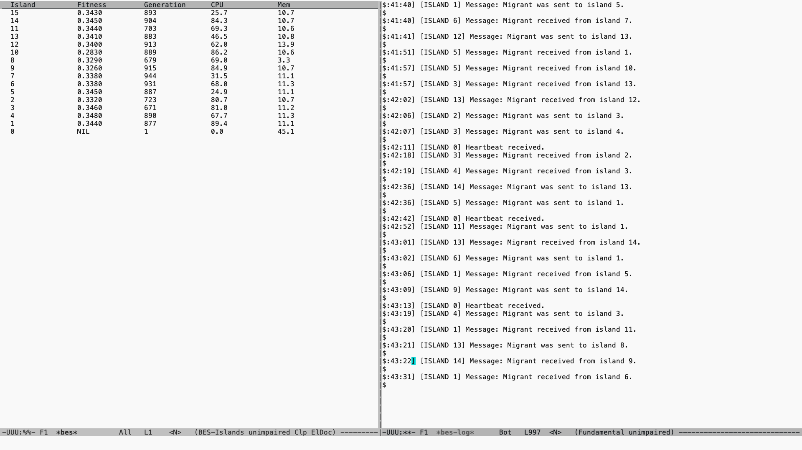
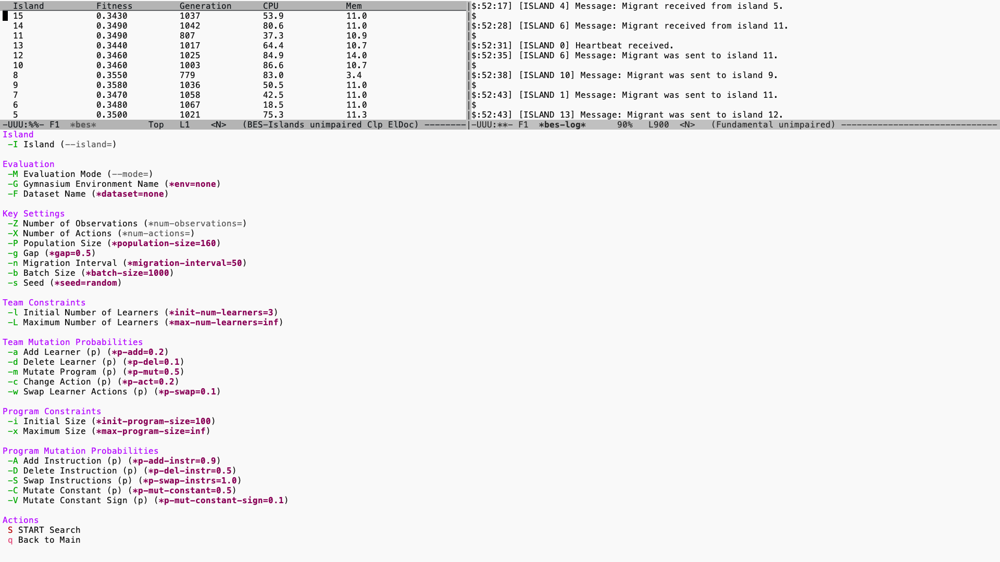

* Welcome to BES! (Better Evolution System (than before))

** Getting started with Common Lisp and Emacs.

Q: /Why design TPG in Common Lisp over Python?/
A: Tangled Program Graphs (Hereafter, TPG) are inherently computationally expensive. While the canonical TPG implementations written by Stephen Kelly in C++, and written by Robert Smith in Java are fast. To me, Lisp is more of a pleasure to write in and has a better developer experience than either language. SBCL (Steel Bank Common Lisp) can make Lisp competitive with C++ code. Plus, there's a lot of cool functionality around Common Lisp that you're not going to see in other languages.

a.) *Homoiconicity*

Other resources can describe this concept better than what I can, but essentially this property means that there is no difference between data and code. In other languages, there's a distinction between the syntax of the language and the data that is flowing through the program. In Lisp, there is no such barrier.

b.) *REPL*

Lisp is an interactive language. If you're not familiar with Lisp, then most of the other languages you are going to be familiar with usually expect you to program like this: write code, compile code, test your code, if it fails start over. Programming in Lisp is different because using the REPL allows you to alter your code while its still running. It allows you to inspect variables, redefine functions, and if it crashes then you can simply step back and fix the issue on the fly (a nice feature to have when you're 1000 generations in and something goes wrong.)

c.) *Emacs*

Unlike other languages, the Lisp variants are typically written in Emacs. In the case of Common Lisp, you'll need an Emacs package called *Sly* to be able to access a REPL. It's not particularly hard to set up but takes some familiarity. The process looks something like this:

1.) Install SBCL
2.) Install Emacs
3.) Customize ~/.emacs to use use-package and then install SLY.
4.) Install Quicklisp

Once you have that, you have all the essential dependencies to run this repository.

** Getting started with this repository

Genetic programming is ``embarrasingly parallel.'' As such, this repository has recently been re-vamped to assume a distributed computing paradigm
(TPG runs on multiple computers/nodes in a cluster at once.) This means that everything is asynchronous and networked by design. Including the starting and stopping of searches and the setting of hyperparameters.

*** Giving /bes/ to Quicklisp so you can load it as a module.

Rather than loading this repo by /eval-buffer/ing every file in the correct order, the more convenient way to load the code is to use Quicklisp.
Quicklisp looks for repositories in the folder ~/quicklisp/local-projects.

You can make a symlink from your repository to this location with the following:

#+BEGIN_SRC sh
  ln -s /fully/expanded/path/to/your/repos/bes /fully/expanded/path/to/your/quicklisp/local-projects/
#+END_SRC

*** Author's note on the distributed computing aspect of this system.

As mentioned earlier, this system is distributed and *decentralized* by design.

/Q: What do you mean decentralized?/

A: Each node on the cluster is responsible for its own evolution including: fitness evaluation, selection and variation.
After a specified generational interval, the best individual from each node will be sent to its neighbouring nodes.

/Q: What neighbours?/

A: Having a fully-connected graph of nodes isn't actually desirable. By restricting the amount of nodes that a node can send
its individuals to we encourage niche-ing or local competition leading to better diversity.

/Q: Why not evaluate the individuals in parallel across nodes but then send the results back for selection and variation?/

A: TPG individuals can get large and sending an entire population back and forth over the network introduces overhead. This overhead
can actually take longer than the fitness evaluation itself.

* Key settings you need to change

1.)

In order for Emacs and the BES servers to communicate, you first need to set the IP address of the Emacs client.
In /networking.lisp/ change

#+BEGIN_SRC lisp
  *telemetry-ip*
#+END_SRC

to the IP address of the machine you are running Emacs on. If this is a local setup, use "127.0.0.1".

2.)

Next, you need to set the IP addresses and the corresponding island ID for each node/server you are running.
You can do this by setting in /networking.lisp/:

#+BEGIN_SRC lisp
  *islands*
#+END_SRC

3.)

Next, you need to set the topology (i.e. which nodes can send teams to which nodes.) You can do this by setting in /networking.lisp/:

#+BEGIN_SRC lisp
  *topology*
#+END_SRC

4.)

Each node in my compute cluster has 160 CPU cores. In order to leave some cores free for networking and for the operating system, I allocate 140 cores for worker-threads.
You can adjust the number of threads (multi-threading is used for fast fitness evaluation) in /globals.lisp/ by setting:

#+BEGIN_SRC lisp
+num-threads+
#+END_SRC

5.)

You can specify the number of registers that each program has in TPG (as per any LinearGP implementation). This is intentionally hardcoded
so the compiler can optimize-to-death the execution of programs.

** Starting the nodes/servers.

In Sly /(M-x sly)/, you can now load the package with the following:

#+BEGIN_SRC lisp
    (ql:quickload :bes)
#+END_SRC

After you've loaded the package, you can now start the server.

#+BEGIN_SRC lisp
  (bes:start-server)
#+END_SRC

Once you've done this, great! Now your /BES/ is listening to your Emacs.

If you need to stop the server, there is also:

#+BEGIN_SRC lisp
  (bes:stop-server)
#+END_SRC

* Enabling the *bes* package in Emacs.

#+BEGIN_SRC sh
      C-x C-f ./emacs/bes.el
      M-x eval-buffer
      M-x bes
#+END_SRC

The above code opens the /bes.el/ file from the working directory. /eval-buffer/ executes each expression in the file sequentially. /bes/ opens two buffers (windows) within emacs.
The first buffer is *bes* which is the main control panel for interacting wih the TPG nodes/servers. *bes* shows things like fitness and generation for the connected nodes. The second buffer is *bes-log* which receives messages, warnings, and errors from the nodes.

* Starting searches in TPG

When you're in the *bes* buffer, you can press

#+BEGIN_SRC sh
  C-c C-c
#+END_SRC

to bring up a /transient/ menu.

The first thing you should do is enable auto-refreshing of the *bes* panel when new fitness scores or system information arrives.

After you have done this you can start/stop searches of individual nodes/islands or start/stop searches of all nodes/islands.

#+CAPTION: The menu for starting searches. By pressing "-I" you can specify either all or a specific island to start the search for. You can set other key parameters such as the evaluation mode (offline evaluation against a dataset or online evaluation against a gymnasium environment.). You can specify the number of observations in the state-space, the number of actions for the RL task (or the number of classes in the dataset). This is where you will set other hyperparameters customary to TPG as well.

** Understanding the search parameters

| Parameter                  | Key Press | Role                                                                                                                                                                             |
| Island                     | -I        | The island ID you want to run this against. Select --all for this to be a global search across all nodes.                                                                        |
| Evaluation Mode            | -M        | BES supports both offline learning (learning from a dataset with no task interaction) and online learning (interacting with a simulator.) This parameter sets which mode to use. |
| Gymnasium Environment Name | -G        | This tells BES which Gymnasium environment to load, e.g. "HalfCheetah-v5"                                                                                                        |
| Dataset Name               | -F        | The name of the dataset to load. BES looks for datasets in ~/.datasets/.                                                                                                         |
| Number of Observations     | -Z        | How many observations are there in the state space or how many features are there in the dataset?                                                                                |
| Number of Actions          | -X        | How many actions are there in the action space or how many classes are there in the dataset?                                                                                     |
| Population Size            | -P        | The size of the population (number of root teams).                                                                                                                               |
| Gap                        | -g        | What percentage of the teams to remove during selection.                                                                                                                         |
| Migration Interval         | -n        | How many generations should we wait between sending individuals to other islands?                                                                                                |
| Batch Size                 | -b        | If using an offline dataset, how many transitions do we sample from the dataset?                                                                                                 |
| Seed                       | -s        | By setting a seed, you can reproduce the same experiment.                                                                                                                        |
| Initial Number of Learners | -l        | How many learners should a team have when a team is first made?                                                                                                                  |
| Maximum Number of Learners | -L        | At most how many learners can a team have?                                                                                                                                       |
| Add Learner (p)            | -a        | What's the probability that when a team is mutated a new learner will be added?                                                                                                  |
| Delete Learner (p)         | -d        | What's the probability that when a team is mutated a learner will be deleted?                                                                                                    |
| Mutate Program (p)         | -m        | What's the probability that when a team is mutated, a learner will have its program mutated?                                                                                     |
| Change Action (p)          | -c        | What's the probability that when a learner is mutated, its action will be changed to a new action?                                                                               |
| Swap Learner Actions (p)   | -s        | What's the probability that when a team is mutated, two learners will have their actions swapped?                                                                                |
| Initial Size               | -i        | When a program is made, how many instructions will it have?                                                                                                                      |
| Maximum Size               | -x        | At most, how many instructions can a program have?                                                                                                                               |
| Add Instruction (p)        | -A        | When a learner's program is mutated, what's the probability of adding a new instruction in a random place?                                                                       |
| Delete Instruction (p)     | -D        | When a learner's program is mutated, what's the probability of a random instruction being deleted?                                                                               |
| Swap Instructions (p)      | -S        | When a learner's program is mutated, what's the probability of two instructions being randomly swapped?                                                                          |
| Mutate Constant (p)        | -C        | When a learner's program is mutated, what's the probability of a random constant in its program being perturbed by noise?                                                        |
| Mutate Constant Sign (p)   | -V        | When a learner's program is mutated, what's the probability of a random constant having its sign switched? (negative or positive).                                               |
